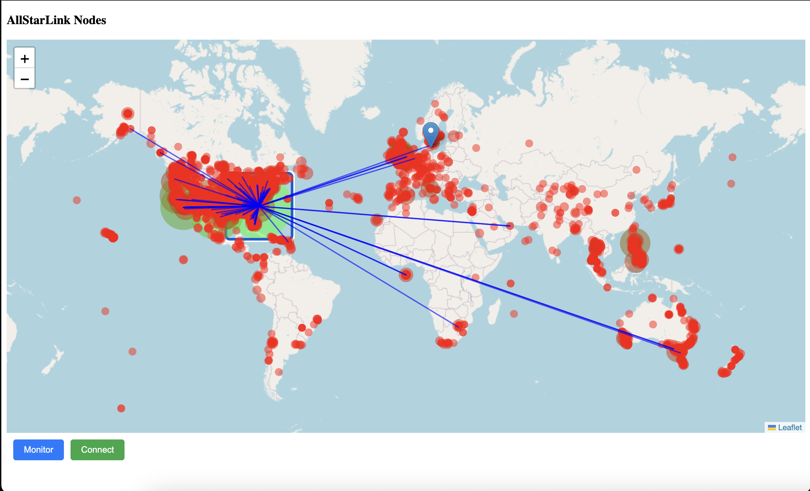

# AllStarMap

A Dash-based web application to visualize AllStarLink nodes on a map and manage connections via Asterisk AMI.



## Features

* Displays all available nodes, with circle sizes proportional to the number of connections
* Shows details for a single node and its connection links
* Buttons to monitor, connect, or disconnect links directly from the interface
* Configuration via an `allstarmap.conf` file

## Requirements

* Python 3.7+
* See `requirements.txt`

## Installation

1. Clone this repository:

   ```bash
   git clone https://github.com/your-username/allstarmap.git
   cd allstarmap
   ```
2. (Optional) Create and activate a virtual environment:

   ```bash
   python3 -m venv .venv
   source .venv/bin/activate
   ```
3. Install dependencies:

   ```bash
   pip install -r requirements.txt
   ```
4. Copy and edit the example config:

   ```bash
   cp allstarmap.conf.example allstarmap.conf
   # Edit allstarmap.conf with your Asterisk username, password, and node number
   ```

> **Note:** If you install this application on an AllStarLink node created using the official appliance image from the AllStarLink repository (`https://allstarlink.github.io/install/pi-appliance/pi-detailed/`), you must open port 8501 on the firewall:
>
> ```bash
> sudo firewall-cmd --zone=allstarlink --add-port=8501/tcp --permanent
> sudo firewall-cmd --reload
> ```

## Usage

```bash
python allstarmap.py
```

Then open your browser to `http://localhost:8501` to view the map.

## Configuration File (`allstarmap.conf`)

```ini
# allstarmap.conf
username = YOUR_USER
password = YOUR_PASS
node     = YOUR_NODE_NUMBER
```

