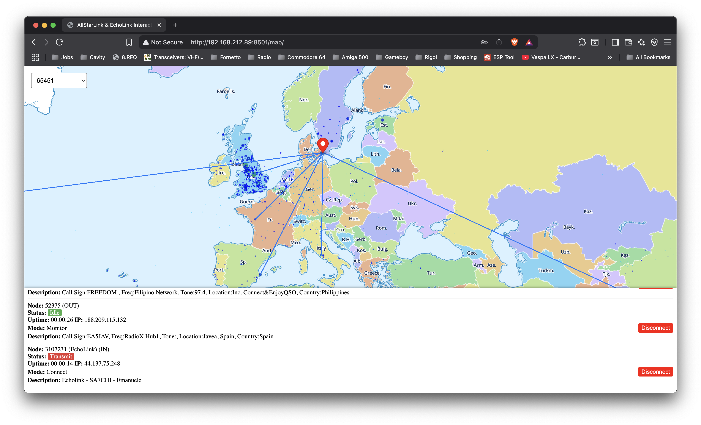

# AllStarLink Interactive Map

An interactive web client built with MapLibre GL JS, deck.gl and a FastAPI backend.  
Displays AllStarLink nodes, shows detailed info on hover/click, and lets you perform actions like Monitor, Connect, Muted and Disconnect.

## Features

- **User authentication** via FastAPI `/auth/token`
- **Interactive map** of nodes with MapLibre GL JS + deck.gl
- **Hover** to preview node info
- **Click** to lock info panel and view connections
- **Disconnect** button in home-node connections with auto-refresh
- **Home node** selection from dropdown

## Requirements

- Python 3.8+
- FastAPI & Uvicorn
- Modern web browser (Chrome, Firefox, Edge)

## Installation

1. **Clone the repo**  
   ```bash
   git clone https://github.com/yourusername/allstarmap.git
   cd allstarmap
   ```

2. **Install Python dependencies**  
   ```bash
   pip install -r requirements.txt
   ```

## Configuration

Open `static/index.html` (or `templates/index.html` if using templating) and set the API base URL:

```js
const API_BASE = 'http://<YOUR_FASTAPI_HOST>:8501';
```

Replace `<YOUR_FASTAPI_HOST>` with the hostname or IP where your FastAPI server runs.

## Running

Start the FastAPI server (serves both API and frontend):

```bash
uvicorn allstarapi:app --host 0.0.0.0 --port 8501
```

Then browse to:

```
http://localhost:8501/
```

## Screenshot


